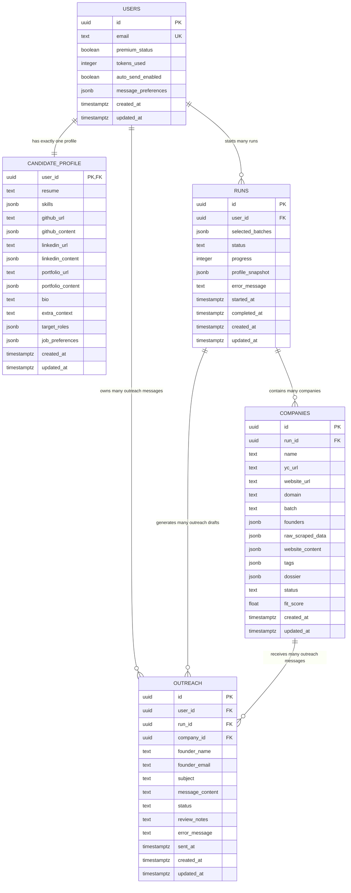
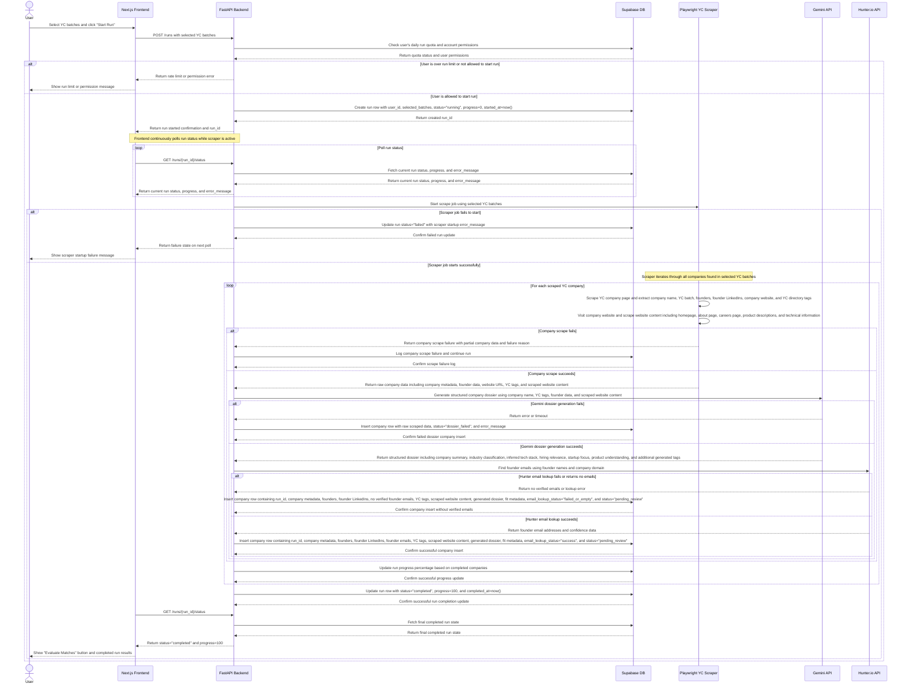

# ScoutReach Architecture

ScoutReach is an AI-powered founder outreach platform for discovering YC startups, evaluating company fit through a swipe-based workflow, generating personalized founder outreach, reviewing/editing messages, and sending approved emails.

The MVP is YC-only and should prioritize a lean, reliable, manually reviewed workflow before introducing broader automation.

---

## 1. Core Product Flow

ScoutReach follows this pipeline:

```text
User profile setup
→ Start YC run
→ Scrape YC/company data
→ Generate AI company dossiers
→ Find founder emails
→ Store companies
→ User swipes accepted/rejected companies
→ Generate outreach drafts
→ User reviews/edits/regenerates messages
→ User sends approved messages
→ Track results/history
```

---

### 1.1 Auth + Onboarding Flow

Public MVP now includes explicit auth + onboarding gating before dashboard access.

```text
Landing (/)
→ Auth (/auth; email/password or Google)
→ Name step
→ Profile sources step (resume/github/linkedin/portfolio)
→ Targets step (roles + industry prefs)
→ Message preferences step
→ Calibration step (example swipes + optional feedback regeneration loop, max 3)
→ Dashboard (/dashboard)
```

Route guard rules:

- unauthenticated user: onboarding/dashboard redirect to `/auth`
- authenticated + incomplete onboarding: dashboard redirects to saved onboarding step
- authenticated + completed onboarding: onboarding routes redirect to `/dashboard`

Backend endpoints used by this flow:

- `GET /me`
- `PATCH /me`
- `GET /candidate-profile`
- `PUT /candidate-profile`
- `GET /settings`
- `PATCH /settings`
- `GET /onboarding/state`
- `POST /onboarding/example-messages`
- `POST /onboarding/example-feedback`
- `POST /onboarding/complete`

---

## 2. System Responsibilities

### User
The person using ScoutReach to discover startups and send personalized outreach.

### Next.js Frontend
Responsible for:
- Authentication UI
- Onboarding flow
- Dashboard
- Start run action
- Polling run status
- Company swipe UI
- Message review/edit/regenerate UI
- Send approved messages UI
- Settings/profile management

The frontend should not directly talk to Gemini, Hunter, Gmail, or the scraper. It talks to the FastAPI backend.

### FastAPI Backend
Central orchestration layer.

Responsible for:
- Authenticated API endpoints
- Creating runs
- Checking permissions and rate limits
- Starting scraper jobs
- Reading/writing Supabase data
- Calling Gemini
- Calling Hunter.io
- Calling Gmail API
- Updating run/company/outreach statuses
- Handling errors
- Returning clean API responses to the frontend

### Supabase DB
Primary database and state store.

Responsible for:
- Users
- Candidate profiles
- Runs
- Companies
- Outreach drafts/messages
- Status tracking
- Progress tracking
- Error messages
- Profile snapshots

### Playwright YC Scraper
Responsible for raw data collection.

The scraper collects:
- YC company name
- YC batch
- founder names
- founder LinkedIn URLs
- company website
- YC directory tags
- YC page data
- company website content

The scraper does **not** decide whether a company is good. It only collects raw data.

### Gemini API
Responsible for AI interpretation and generation.

Used for:
- Company dossier generation
- Company summarization
- Industry classification
- Tags
- Fit metadata
- Personalized message generation
- Message regeneration using user critique

Gemini should not own system state. It only receives context and returns structured output.

### Hunter.io API
Responsible for email discovery.

Used for:
- Finding founder emails from founder names + company domain
- Returning email confidence data
- Marking whether lookup succeeded, failed, or returned no verified email

### Gmail API
Responsible for sending emails.

Used only after:
- outreach draft exists
- message is approved or auto-send is explicitly allowed
- sending quota is checked

For public MVP, manual review should be required before sending.

---

## 3. MVP Release Rules

For the initial public MVP:

- YC-only scraping
- Manual message review required before sending
- `auto_send_enabled` should default to `false`
- Auto-send may exist in schema but should not be enabled for normal public users
- Every send action must be explicit and user-approved
- Rate limits must exist for:
  - run creation
  - message generation
  - message regeneration
  - sending
- External API failures should not crash the whole app
- Scraper/Gemini/Hunter failures should be stored as errors and surfaced in the UI
- Keep architecture simple and avoid premature abstractions

---

## 4. Database Architecture



---

## 5. Database Table Responsibilities

### `users`

Stores account-level data.

Responsibilities:
- user identity
- email
- premium/subscription flag
- token usage
- auto-send preference
- message preferences
- timestamps

Important notes:
- `id` is the primary key.
- `email` must be unique.
- `auto_send_enabled` should default to `false`.
- `message_preferences` should be `jsonb`.

---

### `candidate_profile`

Stores the user's professional context.

Responsibilities:
- resume
- skills
- GitHub URL/content
- LinkedIn URL/content
- portfolio URL/content
- bio
- extra context
- target roles
- job preferences

Used by:
- dossier fit reasoning
- outreach generation
- regeneration

Important notes:
- `user_id` is both PK and FK.
- This is one-to-one with `users`.
- Long-term reusable profile data lives here.
- Per-run frozen profile data lives in `runs.profile_snapshot`.

---

### `runs`

Stores one execution of the YC scraping/outreach pipeline.

A run begins when the user clicks "Start Run."

Responsibilities:
- selected YC batches
- run status
- progress percentage
- error message
- start/completion timestamps
- frozen profile snapshot

Important notes:
- Every run belongs to one user.
- A user can have many runs.
- `profile_snapshot` freezes the user profile at run time so old runs remain consistent even if the user later edits their profile.

Example statuses:
- `queued`
- `running`
- `scraping`
- `enriching`
- `dossier_generating`
- `completed`
- `completed_with_errors`
- `failed`
- `messages_generating`
- `messages_generated`
- `sending`

---

### `companies`

Stores scraped and enriched YC companies.

Responsibilities:
- raw YC/company metadata
- founder data
- founder LinkedIns
- founder emails
- website content
- generated dossier
- tags
- fit score
- user review status

Important notes:
- Every company belongs to one run.
- A run contains many companies.
- `founders` should be an array of objects, not separate arrays.

Example `founders` shape:

```json
[
  {
    "name": "Founder Name",
    "linkedin_url": "https://linkedin.com/in/example",
    "email": "founder@example.com",
    "email_confidence": 87
  }
]
```

Example statuses:
- `pending_review`
- `accepted`
- `rejected`
- `dossier_failed`

---

### `outreach`

Stores generated outreach messages.

Responsibilities:
- generated subject
- generated message body
- founder target
- approval/review state
- send state
- error message
- sent timestamp

Important notes:
- Every outreach row belongs to:
  - one user
  - one run
  - one company
- Outreach rows are created after message generation.
- Sending should only happen for approved outreach in the public MVP.

Example statuses:
- `draft`
- `approved`
- `needs_review`
- `generation_failed`
- `sent`
- `failed`

---

## 6. Sequence Diagram 1: Run Creation, Scraping, and Dossier Generation



---

## 7. Sequence Diagram 2: Match Evaluation, Message Generation, Review, and Sending

```mermaid
sequenceDiagram
    actor User
    participant Frontend as Next.js Frontend
    participant Backend as FastAPI Backend
    participant DB as Supabase DB
    participant Gemini as Gemini API
    participant Gmail as Gmail API

    User->>Frontend: Click "Evaluate Matches"

    Frontend->>Backend: GET /runs/{run_id}/companies?status=pending_review
    Backend->>DB: Fetch companies for run where status="pending_review"
    DB-->>Backend: Return pending company rows with dossiers, tags, founders, website data, founder emails, and fit metadata
    Backend-->>Frontend: Return swipe queue with company cards and dossier details

    Note over User,Frontend: User reviews each company in Tinder-style swipe UI

    loop For each company in swipe queue
        alt User accepts company
            User->>Frontend: Swipe right on company card
            Frontend->>Backend: PATCH /companies/{company_id} with status="accepted"
            Backend->>DB: Update company status to "accepted" for selected company
            DB-->>Backend: Confirm company accepted
            Backend-->>Frontend: Return accept success
        else User rejects company
            User->>Frontend: Swipe left on company card
            Frontend->>Backend: PATCH /companies/{company_id} with status="rejected"
            Backend->>DB: Update company status to "rejected" for selected company
            DB-->>Backend: Confirm company rejected
            Backend-->>Frontend: Return reject success
        end
    end

    Frontend->>Backend: GET /runs/{run_id}/companies/pending-count
    Backend->>DB: Count companies where run_id matches and status="pending_review"
    DB-->>Backend: Return pending_count
    Backend-->>Frontend: Return pending_count=0
    Frontend-->>User: Show "Generate Messages" button

    User->>Frontend: Click "Generate Messages"

    Frontend->>Backend: POST /runs/{run_id}/generate-messages

    Backend->>DB: Check user's daily message generation quota and account permissions
    DB-->>Backend: Return quota status and user permissions

    alt User is over message generation limit or not allowed to generate messages
        Backend-->>Frontend: Return rate limit or permission error
        Frontend-->>User: Show message generation limit or permission message
    else User is allowed to generate messages
        Backend->>DB: Fetch accepted companies for run with company metadata, founders, founder emails, dossier, tags, sector, batch, website URL, and scraped content
        DB-->>Backend: Return accepted companies

        Backend->>DB: Fetch run profile_snapshot, user message_preferences, target roles, job preferences, and auto_send setting
        DB-->>Backend: Return generation context and user sending preferences

        Note over Backend,Gemini: Backend generates one outreach draft per accepted company and founder target

        loop For each accepted company and selected founder target
            Backend->>Backend: Build generation payload using candidate snapshot, target roles, job preferences, message preferences, founder data, company dossier, tags, and scraped company context
            Backend->>Gemini: Generate personalized outreach subject and message body

            alt Gemini message generation fails
                Gemini-->>Backend: Return error or timeout
                Backend->>DB: Insert outreach row with status="generation_failed", founder target, company_id, run_id, user_id, and error_message
                DB-->>Backend: Confirm failed outreach generation row
            else Gemini message generation succeeds
                Gemini-->>Backend: Return subject, message_content, personalization rationale, and confidence metadata
                Backend->>DB: Insert outreach draft with user_id, run_id, company_id, founder_name, founder_email, subject, message_content, status="draft", review_notes=null, error_message=null, sent_at=null
                DB-->>Backend: Confirm outreach draft inserted
            end
        end

        Backend->>DB: Update run status to "messages_generated"
        DB-->>Backend: Confirm run status update

        Note over Backend,Frontend: Public MVP should force manual review before sending, even if auto_send exists in the schema

        alt Auto-send enabled and allowed for this account
            Backend->>DB: Check user's daily sending quota before sending
            DB-->>Backend: Return sending quota status

            alt User is over sending limit
                Backend-->>Frontend: Return sending rate limit error
                Frontend-->>User: Show sending limit message and keep drafts for review
            else Sending quota available
                Backend-->>Frontend: Return message generation complete and sending started
                Backend->>DB: Fetch outreach drafts for run where status="draft"
                DB-->>Backend: Return outreach drafts ready to send

                loop For each outreach draft
                    Backend->>Gmail: Send email using founder_email, subject, and message_content
                    Gmail-->>Backend: Return send success or failure

                    alt Email send succeeds
                        Backend->>DB: Update outreach status="sent", sent_at=now(), error_message=null, updated_at=now()
                        DB-->>Backend: Confirm sent status update
                    else Email send fails
                        Backend->>DB: Update outreach status="failed", error_message=send failure reason, updated_at=now()
                        DB-->>Backend: Confirm failed status update
                    end
                end

                Backend->>DB: Update run status to "completed" or "completed_with_errors" based on send results
                DB-->>Backend: Confirm run completion update
                Backend-->>Frontend: Return final send results
                Frontend-->>User: Show dashboard with sent results, failed results, and outreach history
            end

        else Auto-send disabled or manual review required
            Backend-->>Frontend: Return message generation complete and drafts ready for review
            Frontend-->>User: Show "Evaluate Messages" button

            User->>Frontend: Click "Evaluate Messages"
            Frontend->>Backend: GET /runs/{run_id}/outreach?status=draft
            Backend->>DB: Fetch draft outreach rows for run
            DB-->>Backend: Return draft outreach rows with company and founder context
            Backend-->>Frontend: Return message review queue

            Note over User,Frontend: User reviews generated messages in swipe/edit UI

            loop For each draft message
                alt User approves message
                    User->>Frontend: Approve message
                    Frontend->>Backend: PATCH /outreach/{outreach_id} with status="approved"
                    Backend->>DB: Update outreach status to "approved"
                    DB-->>Backend: Confirm approval update
                    Backend-->>Frontend: Return approval success
                else User edits message
                    User->>Frontend: Edit subject, message body, or review notes
                    Frontend->>Backend: PATCH /outreach/{outreach_id} with updated subject, message_content, and review_notes
                    Backend->>DB: Update outreach subject, message_content, review_notes, and updated_at
                    DB-->>Backend: Confirm edit update
                    Backend-->>Frontend: Return edit success
                else User requests regeneration
                    User->>Frontend: Click "Regenerate" with critique or preference change
                    Frontend->>Backend: POST /outreach/{outreach_id}/regenerate
                    Backend->>DB: Check user's daily regeneration quota
                    DB-->>Backend: Return regeneration quota status

                    alt User is over regeneration limit
                        Backend-->>Frontend: Return regeneration rate limit error
                        Frontend-->>User: Show regeneration limit message
                    else Regeneration quota available
                        Backend->>DB: Fetch outreach row, related company dossier, founder data, profile_snapshot, job preferences, and message preferences
                        DB-->>Backend: Return regeneration context
                        Backend->>Gemini: Regenerate personalized subject and message using original context plus user critique

                        alt Gemini regeneration fails
                            Gemini-->>Backend: Return regeneration error or timeout
                            Backend->>DB: Update outreach error_message with regeneration failure reason and keep previous draft
                            DB-->>Backend: Confirm regeneration failure update
                            Backend-->>Frontend: Return regeneration failure while preserving previous draft
                        else Gemini regeneration succeeds
                            Gemini-->>Backend: Return regenerated subject, message_content, rationale, and confidence metadata
                            Backend->>DB: Update outreach with regenerated subject, regenerated message_content, review_notes, status="draft", and updated_at
                            DB-->>Backend: Confirm regenerated draft update
                            Backend-->>Frontend: Return regenerated message
                        end
                    end
                else User rejects message
                    User->>Frontend: Reject message
                    Frontend->>Backend: PATCH /outreach/{outreach_id} with status="rejected"
                    Backend->>DB: Update outreach status to "rejected"
                    DB-->>Backend: Confirm rejected update
                    Backend-->>Frontend: Return rejected success
                end
            end

            Frontend->>Backend: GET /runs/{run_id}/outreach/review-summary
            Backend->>DB: Count outreach rows by status for run
            DB-->>Backend: Return counts for approved, draft, needs_review, rejected, sent, failed, and generation_failed messages
            Backend-->>Frontend: Return review summary
            Frontend-->>User: Show "Send Approved Messages" button and review summary

            User->>Frontend: Click "Send Approved Messages"

            Frontend->>Backend: POST /runs/{run_id}/send-approved

            Backend->>DB: Check user's daily sending quota and account permissions
            DB-->>Backend: Return sending quota status and user permissions

            alt User is over sending limit or not allowed to send
                Backend-->>Frontend: Return sending rate limit or permission error
                Frontend-->>User: Show sending limit or permission message
            else User is allowed to send approved messages
                Backend->>DB: Fetch outreach rows where run_id matches and status="approved"
                DB-->>Backend: Return approved outreach rows

                loop For each approved outreach message
                    Backend->>Gmail: Send email using founder_email, subject, and message_content
                    Gmail-->>Backend: Return send success or failure

                    alt Email send succeeds
                        Backend->>DB: Update outreach status="sent", sent_at=now(), error_message=null, updated_at=now()
                        DB-->>Backend: Confirm sent status update
                    else Email send fails
                        Backend->>DB: Update outreach status="failed", error_message=send failure reason, updated_at=now()
                        DB-->>Backend: Confirm failed status update
                    end
                end

                Backend->>DB: Update run status to "completed" or "completed_with_errors" based on send results
                DB-->>Backend: Confirm run completion update
                Backend-->>Frontend: Return final send results
                Frontend-->>User: Show dashboard with sent results, failed results, and outreach history
            end
        end
    end
```



---

## 8. User Flow Diagrams

The project has three user flow diagrams:

### 8.1 Registration / Onboarding Flow

Purpose:
- Create account
- Collect candidate context
- Collect target role/job preferences
- Learn message style preferences
- Show the user an example output before entering the dashboard

Flow:

```text
Landing page
→ Login / Sign up
→ Authenticate with Google or LinkedIn
→ Add resume, LinkedIn, GitHub, portfolio
→ Set target roles and job preferences
→ Select preferred locations and industries
→ Swipe on message style examples
→ View generated example message
→ Give feedback or critique
→ Regenerate/fix example if needed
→ Enter dashboard
```

---

### 8.2 Main Product Flow

Purpose:
- Execute the core ScoutReach pipeline.

Flow:

```text
Dashboard idle
→ Start new run
→ Scraper running
→ Scraping complete
→ Evaluate matches
→ Swipe companies accepted/rejected
→ Generate messages
→ Review generated outreach
→ Approve/edit/regenerate/reject messages
→ Send approved messages
→ View results/history
→ Return to dashboard
```

---

### 8.3 Settings Flow

Purpose:
- Allow users to update stored profile and preferences.

Flow:

```text
Dashboard
→ Open profile/settings menu
→ Settings page
→ Edit profile information
→ Edit job preferences
→ Edit message preferences
→ Save changes
→ Show success confirmation
→ Return to settings or dashboard
```

Settings sections:
- Profile
- Job Preferences
- Message Preferences

---

## 9. API Surface

The backend should expose a small, focused API.

### Runs

```text
POST /runs
GET /runs/{run_id}/status
```

### Companies

```text
GET /runs/{run_id}/companies?status=pending_review
GET /runs/{run_id}/companies/pending-count
PATCH /companies/{company_id}
```

### Message Generation

```text
POST /runs/{run_id}/generate-messages
```

### Outreach Review

```text
GET /runs/{run_id}/outreach?status=draft
PATCH /outreach/{outreach_id}
POST /outreach/{outreach_id}/regenerate
GET /runs/{run_id}/outreach/review-summary
```

### Sending

```text
POST /runs/{run_id}/send-approved
```

### Profile / Settings

```text
GET /me
GET /me/profile
PATCH /me/profile
PATCH /me/message-preferences
PATCH /me/job-preferences
```

---

## 10. Status Model

### Run Statuses

```text
queued
running
scraping
enriching
dossier_generating
completed
completed_with_errors
failed
messages_generating
messages_generated
sending
```

### Company Statuses

```text
pending_review
accepted
rejected
dossier_failed
scrape_failed
email_lookup_failed
```

### Outreach Statuses

```text
draft
approved
needs_review
rejected
generation_failed
sending
sent
failed
```

---

## 11. Rate Limit Rules

Rate limits should be checked before:

```text
POST /runs
POST /runs/{run_id}/generate-messages
POST /outreach/{outreach_id}/regenerate
POST /runs/{run_id}/send-approved
```

Initial public MVP limits can be simple:
- daily run limit
- daily message generation limit
- daily regeneration limit
- daily send limit

Quota state can be derived from counts in existing tables at first. If it becomes messy, add a dedicated `usage_events` table later.

---

## 12. Error Handling Rules

### Scraper Errors

If scraper startup fails:
- mark run as `failed`
- save `error_message`
- frontend shows failure through polling

If one company scrape fails:
- log the failed company
- continue the run
- do not fail the whole run unless the entire scraper crashes

### Gemini Errors

If dossier generation fails:
- insert company with `status="dossier_failed"`
- preserve raw scraped data
- store error

If message generation fails:
- insert outreach row with `status="generation_failed"`
- store error message

If regeneration fails:
- keep previous draft
- update `error_message`
- show frontend failure message

### Hunter Errors

If Hunter fails:
- still store company
- mark email lookup as failed or empty
- allow user to review company anyway

### Gmail Errors

If send succeeds:
- set outreach `status="sent"`
- set `sent_at=now()`

If send fails:
- set outreach `status="failed"`
- store `error_message`

---

## 13. Architecture Principles

### Keep the backend as the orchestrator

The frontend should never directly call:
- Gemini
- Hunter
- Gmail
- Playwright scraper

### Keep the scraper dumb

The scraper collects raw data only. It does not decide company quality.

### Keep Gemini stateless

Gemini receives context and returns structured output. It should not own persistence or app state.

### Store partial failures

For public MVP, partial failure is better than all-or-nothing failure.

Example:
- if Hunter fails, still keep the company
- if Gemini fails for one company, continue with others
- if Gmail fails for one message, mark that message failed and continue

### Manual review first

Public MVP should require review before sending.

### Avoid premature normalization

For MVP:
- `founders` can be `jsonb`
- `dossier` can be `jsonb`
- `website_content` can be `jsonb`
- `message_preferences` can be `jsonb`

Normalize later only if real usage proves it is necessary.

---

## 14. Known Gaps for Future Versions

Do not build these unless needed:

```text
run_logs table
usage_events table
founders table
message_versions table
email_events table
reply tracking
open tracking
team workspaces
multi-directory scraping
non-YC startup sources
CRM integrations
advanced scoring models
automatic follow-ups
```

---

## 15. Future Tables That May Be Added Later

### `run_logs`

Useful for debugging scraper/API failures.

```text
id uuid PK
run_id uuid FK
level text
message text
metadata jsonb
created_at timestamptz
```

### `usage_events`

Useful if quotas become hard to calculate.

```text
id uuid PK
user_id uuid FK
event_type text
metadata jsonb
created_at timestamptz
```

### `message_versions`

Useful if regeneration history matters.

```text
id uuid PK
outreach_id uuid FK
subject text
message_content text
reason text
created_at timestamptz
```

### `email_events`

Useful for send/open/reply tracking.

```text
id uuid PK
outreach_id uuid FK
event_type text
metadata jsonb
created_at timestamptz
```

---

## 16. Build Order

Recommended implementation order:

```text
1. Set up repo structure
2. Create Supabase schema
3. Build FastAPI app shell
4. Add Supabase client
5. Implement user/profile basics
6. Implement POST /runs
7. Implement GET /runs/{run_id}/status
8. Implement scraper job
9. Store scraped companies
10. Add Gemini dossier generation
11. Add Hunter email lookup
12. Build frontend dashboard and polling
13. Build company swipe UI
14. Implement company status updates
15. Implement message generation
16. Build message review UI
17. Implement regeneration
18. Implement send-approved through Gmail
19. Add rate limits
20. Add error handling polish
21. Public beta test
```

---

## 17. Codex / Agent Instructions

When using Codex or another coding agent:

```text
Read this architecture file before coding.
Implement one phase at a time.
Do not redesign the architecture unless explicitly asked.
Do not add new dependencies unless necessary.
Do not build future-version features unless requested.
Keep MVP lean.
Prefer boring, explicit code over clever abstractions.
Preserve existing behavior unless instructed.
After changes, summarize files changed and tests run.
If something is unclear, make the safest minimal assumption and leave a TODO.
```

---

## 18. Final MVP Definition

The MVP is complete when a user can:

```text
1. Create an account
2. Add candidate/profile context
3. Select YC batches
4. Start a run
5. Watch scrape progress
6. View scraped/enriched companies
7. Swipe companies accepted/rejected
8. Generate messages for accepted companies
9. Review/edit/regenerate messages
10. Send approved messages
11. See sent/failed results
```

Anything beyond that is not required for the initial public MVP.
