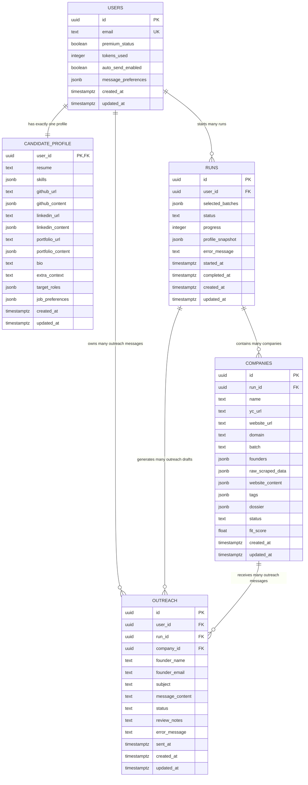

# DB_SCHEMA.md

## Overview

ScoutReach uses Supabase Postgres as the primary database.

The database supports the full MVP pipeline:

1. User creates account and profile.
2. User starts a YC scraping run.
3. Scraper collects company/founder/company-site data.
4. AI generates company dossiers and tags.
5. User swipes companies as accepted/rejected.
6. AI generates outreach drafts.
7. User reviews, edits, regenerates, approves, or rejects messages.
8. Approved outreach messages are sent through Gmail.
9. Results and history are stored.

Core tables:

- `users`
- `candidate_profile`
- `runs`
- `companies`
- `outreach`
- optional but recommended: `run_logs`

---

# Entity Relationship Summary

## Relationships

```text
users 1 -> 1 candidate_profile
users 1 -> many runs
users 1 -> many outreach
runs 1 -> many companies
runs 1 -> many outreach
companies 1 -> many outreach
````

## Mermaid ERD



---

# Table: `users`

Stores account-level user data and global preferences.

## Purpose

This table represents the authenticated user account. It should not store large professional profile data. That belongs in `candidate_profile`.

## Columns

| Column                | Type          | Constraints                     | Description                           |
| --------------------- | ------------- | ------------------------------- | ------------------------------------- |
| `id`                  | `uuid`        | PK, default `gen_random_uuid()` | Internal user ID                      |
| `email`               | `text`        | unique, not null                | User email                            |
| `premium_status`      | `boolean`     | default `false`                 | Whether user has premium access       |
| `tokens_used`         | `integer`     | default `0`                     | AI usage counter                      |
| `auto_send_enabled`   | `boolean`     | default `false`                 | Whether user has opted into auto-send |
| `message_preferences` | `jsonb`       | default `'{}'::jsonb`           | Global message style preferences      |
| `created_at`          | `timestamptz` | default `now()`                 | Row creation timestamp                |
| `updated_at`          | `timestamptz` | default `now()`                 | Last update timestamp                 |

## Example `message_preferences`

```json
{
  "tone": "casual-professional",
  "length": "short",
  "personalization_level": "high",
  "cta_style": "soft_direct",
  "avoid_phrases": ["I hope this email finds you well"],
  "preferred_structure": ["specific_hook", "relevance", "ask"],
  "manual_review_required": true
}
```

## Notes

* Public MVP should keep `auto_send_enabled=false` by default.
* Even if the schema supports auto-send, public beta should require manual review before sending.
* `message_preferences` stores user-level defaults. Per-run frozen copies should be stored in `runs.profile_snapshot`.

---

# Table: `candidate_profile`

Stores professional context used for AI personalization.

## Purpose

This table stores the reusable candidate profile used to generate personalized outreach.

It answers:

* Who is the user professionally?
* What have they built?
* What roles are they targeting?
* What locations and industries do they care about?

## Columns

| Column              | Type          | Constraints                          | Description                                |
| ------------------- | ------------- | ------------------------------------ | ------------------------------------------ |
| `user_id`           | `uuid`        | PK, FK -> `users.id`, cascade delete | Owner of profile                           |
| `resume`            | `text`        | nullable                             | Raw resume text                            |
| `skills`            | `jsonb`       | default `'{}'::jsonb`                | Structured skill data                      |
| `github_url`        | `text`        | nullable                             | GitHub profile URL                         |
| `github_content`    | `jsonb`       | default `'{}'::jsonb`                | Scraped or summarized GitHub data          |
| `linkedin_url`      | `text`        | nullable                             | LinkedIn profile URL                       |
| `linkedin_content`  | `jsonb`       | default `'{}'::jsonb`                | Scraped or summarized LinkedIn data        |
| `portfolio_url`     | `text`        | nullable                             | Portfolio URL                              |
| `portfolio_content` | `jsonb`       | default `'{}'::jsonb`                | Scraped or summarized portfolio data       |
| `bio`               | `text`        | nullable                             | Short professional bio                     |
| `extra_context`     | `text`        | nullable                             | Extra info for personalization             |
| `target_roles`      | `jsonb`       | default `'[]'::jsonb`                | Roles user wants                           |
| `job_preferences`   | `jsonb`       | default `'{}'::jsonb`                | Location, industry, work style preferences |
| `created_at`        | `timestamptz` | default `now()`                      | Row creation timestamp                     |
| `updated_at`        | `timestamptz` | default `now()`                      | Last update timestamp                      |

## Example `skills`

```json
{
  "languages": ["Python", "TypeScript"],
  "frontend": ["React", "Next.js", "Tailwind"],
  "backend": ["FastAPI", "Node.js"],
  "databases": ["Postgres", "Supabase"],
  "ai": ["LLM APIs", "RAG", "prompt engineering"]
}
```

## Example `target_roles`

```json
[
  "Software Engineering Intern",
  "Full Stack Engineering Intern",
  "AI Engineering Intern",
  "Founding Engineer Intern"
]
```

## Example `job_preferences`

```json
{
  "locations": ["San Francisco", "New York", "Remote", "Toronto"],
  "industries": ["AI", "Developer Tools", "Fintech", "B2B SaaS"],
  "company_stage": ["seed", "series_a", "yc"],
  "work_type": ["internship", "part_time", "contract"],
  "start_date": "2027-01",
  "remote_ok": true
}
```

## Notes

* `candidate_profile` is live user data.
* When a user starts a run, copy the relevant candidate/profile/message preferences into `runs.profile_snapshot`.
* This prevents old runs from changing when the user later edits their profile.

---

# Table: `runs`

Stores one execution of the ScoutReach pipeline.

## Purpose

A run represents one batch workflow.

Example:

User selects YC batches, clicks “Start Run”, scraper starts, companies are collected, dossiers are generated, and eventually the run completes.

## Columns

| Column             | Type          | Constraints                                | Description                                  |
| ------------------ | ------------- | ------------------------------------------ | -------------------------------------------- |
| `id`               | `uuid`        | PK, default `gen_random_uuid()`            | Run ID                                       |
| `user_id`          | `uuid`        | FK -> `users.id`, not null, cascade delete | Owner of run                                 |
| `selected_batches` | `jsonb`       | default `'[]'::jsonb`                      | YC batches selected                          |
| `status`           | `text`        | not null                                   | Current run state                            |
| `progress`         | `integer`     | default `0`, check 0-100 recommended       | Progress percentage                          |
| `profile_snapshot` | `jsonb`       | default `'{}'::jsonb`                      | Frozen profile/preferences used for this run |
| `error_message`    | `text`        | nullable                                   | Failure details if run fails                 |
| `started_at`       | `timestamptz` | nullable                                   | When run started                             |
| `completed_at`     | `timestamptz` | nullable                                   | When run completed                           |
| `created_at`       | `timestamptz` | default `now()`                            | Row creation timestamp                       |
| `updated_at`       | `timestamptz` | default `now()`                            | Last update timestamp                        |

## Valid `status` values

Use text for MVP, but treat these like enums in code.

```text
queued
running
scraping
enriching
dossier_generating
completed
completed_with_errors
failed
messages_generating
messages_generated
sending
```

## Example `selected_batches`

```json
["S24", "W25", "S25"]
```

## Example `profile_snapshot`

```json
{
  "resume": "...",
  "skills": {
    "languages": ["Python", "TypeScript"],
    "frontend": ["React", "Next.js"]
  },
  "target_roles": ["Software Engineering Intern", "AI Engineering Intern"],
  "job_preferences": {
    "locations": ["San Francisco", "Remote"],
    "industries": ["AI", "Developer Tools"]
  },
  "message_preferences": {
    "tone": "casual-professional",
    "length": "short",
    "personalization_level": "high",
    "manual_review_required": true
  }
}
```

## Notes

* Frontend polls this table indirectly through `GET /runs/{run_id}/status`.
* `progress` powers loading/progress UI.
* `error_message` should be shown to the user in a readable way.
* Full technical logs should go in `run_logs`, not only in `error_message`.

---

# Table: `companies`

Stores scraped and enriched YC company data.

## Purpose

Each row represents one company discovered in a specific run.

The scraper collects raw company/site data. Gemini generates the dossier, tags, summary, and fit metadata. Hunter adds founder emails.

## Columns

| Column             | Type          | Constraints                               | Description                                  |
| ------------------ | ------------- | ----------------------------------------- | -------------------------------------------- |
| `id`               | `uuid`        | PK, default `gen_random_uuid()`           | Company row ID                               |
| `run_id`           | `uuid`        | FK -> `runs.id`, not null, cascade delete | Parent run                                   |
| `name`             | `text`        | not null                                  | Company name                                 |
| `yc_url`           | `text`        | nullable                                  | YC company page URL                          |
| `website_url`      | `text`        | nullable                                  | Company website                              |
| `domain`           | `text`        | nullable                                  | Normalized domain used for email lookup      |
| `batch`            | `text`        | nullable                                  | YC batch                                     |
| `founders`         | `jsonb`       | default `'[]'::jsonb`                     | Founder names, LinkedIns, emails, confidence |
| `raw_scraped_data` | `jsonb`       | default `'{}'::jsonb`                     | Raw structured scraper output                |
| `website_content`  | `jsonb`       | default `'{}'::jsonb`                     | Scraped website pages/content                |
| `tags`             | `jsonb`       | default `'[]'::jsonb`                     | YC tags + generated tags                     |
| `dossier`          | `jsonb`       | default `'{}'::jsonb`                     | AI-generated company understanding           |
| `status`           | `text`        | default `'pending_review'`                | User decision / processing state             |
| `fit_score`        | `float`       | nullable                                  | AI-generated candidate/company fit score     |
| `created_at`       | `timestamptz` | default `now()`                           | Row creation timestamp                       |
| `updated_at`       | `timestamptz` | default `now()`                           | Last update timestamp                        |

## Valid `status` values

```text
pending_review
accepted
rejected
dossier_failed
scrape_failed
email_lookup_failed
```

## Example `founders`

```json
[
  {
    "name": "Jane Doe",
    "linkedin_url": "https://linkedin.com/in/janedoe",
    "email": "jane@company.com",
    "email_confidence": 87,
    "email_source": "hunter"
  }
]
```

## Example `raw_scraped_data`

```json
{
  "source": "yc_directory",
  "company_name": "Example AI",
  "yc_batch": "S25",
  "yc_description": "AI tools for support teams",
  "founders": [
    {
      "name": "Jane Doe",
      "linkedin_url": "https://linkedin.com/in/janedoe"
    }
  ],
  "website_url": "https://example.ai",
  "yc_tags": ["AI", "B2B", "Customer Support"]
}
```

## Example `website_content`

```json
{
  "homepage": {
    "url": "https://example.ai",
    "title": "Example AI",
    "text": "We help support teams automate..."
  },
  "about": {
    "url": "https://example.ai/about",
    "text": "Our mission is..."
  },
  "careers": {
    "url": "https://example.ai/careers",
    "text": "We are hiring engineers..."
  }
}
```

## Example `tags`

```json
[
  "AI",
  "B2B SaaS",
  "Customer Support",
  "Developer Tools",
  "Hiring Signal"
]
```

## Example `dossier`

```json
{
  "summary": "Example AI builds automation software for customer support teams.",
  "what_they_do": "They use AI agents to triage, respond to, and route support tickets.",
  "industry": "B2B SaaS",
  "customer": "Support teams at mid-market companies",
  "product_category": "AI customer support automation",
  "technical_clues": ["LLMs", "workflow automation", "integrations"],
  "hiring_relevance": "The company appears relevant for a full-stack or AI engineering intern.",
  "personalization_hooks": [
    "They are building AI workflow automation.",
    "They likely need engineers who understand React, APIs, and LLM integrations."
  ],
  "risks_or_unknowns": [
    "No explicit internships listed.",
    "Founder email confidence may be low."
  ]
}
```

## Notes

* `founders` is JSONB for MVP to avoid over-normalizing.
* If founder-level logic becomes complex, create a separate `founders` table later.
* `fit_score` is optional for MVP but useful for sorting the swipe queue.
* Deduping can later be based on `run_id + domain` or global company domain.

---

# Table: `outreach`

Stores generated, reviewed, approved, sent, and failed messages.

## Purpose

Each row represents one outreach message for one founder/company/run/user.

This table powers:

* generated message drafts
* message review
* manual edits
* regeneration
* approval
* sending
* failed send tracking
* outreach history

## Columns

| Column            | Type          | Constraints                                    | Description                    |
| ----------------- | ------------- | ---------------------------------------------- | ------------------------------ |
| `id`              | `uuid`        | PK, default `gen_random_uuid()`                | Outreach row ID                |
| `user_id`         | `uuid`        | FK -> `users.id`, not null, cascade delete     | Owner                          |
| `run_id`          | `uuid`        | FK -> `runs.id`, not null, cascade delete      | Parent run                     |
| `company_id`      | `uuid`        | FK -> `companies.id`, not null, cascade delete | Related company                |
| `founder_name`    | `text`        | nullable                                       | Target founder name            |
| `founder_email`   | `text`        | nullable                                       | Target founder email           |
| `subject`         | `text`        | nullable                                       | Email subject                  |
| `message_content` | `text`        | nullable                                       | Email body                     |
| `status`          | `text`        | default `'draft'`                              | Message lifecycle status       |
| `review_notes`    | `text`        | nullable                                       | User critique/notes            |
| `error_message`   | `text`        | nullable                                       | Generation/send failure reason |
| `sent_at`         | `timestamptz` | nullable                                       | When email was sent            |
| `created_at`      | `timestamptz` | default `now()`                                | Row creation timestamp         |
| `updated_at`      | `timestamptz` | default `now()`                                | Last update timestamp          |

## Valid `status` values

```text
draft
approved
needs_review
rejected
generation_failed
sending
sent
failed
```

## Example draft row

```json
{
  "user_id": "user_uuid",
  "run_id": "run_uuid",
  "company_id": "company_uuid",
  "founder_name": "Jane Doe",
  "founder_email": "jane@example.ai",
  "subject": "Loved what Example AI is building around support automation",
  "message_content": "Hey Jane — I came across Example AI...",
  "status": "draft",
  "review_notes": null,
  "error_message": null,
  "sent_at": null
}
```

## Notes

* Public MVP should require messages to be reviewed before send.
* `approved` means user explicitly approved the message.
* `sent` means Gmail accepted the send request.
* `failed` means sending failed and `error_message` should be populated.
* `generation_failed` means Gemini failed before a usable draft was created.
* A future `message_versions` table may be needed if regeneration history matters.

---

# Optional Table: `run_logs`

Strongly recommended for public MVP debugging.

## Purpose

Stores internal run logs for scraping, enrichment, AI calls, Hunter calls, Gmail sends, and errors.

This keeps `runs.error_message` clean while preserving deeper technical detail.

## Columns

| Column       | Type          | Constraints                     | Description                 |
| ------------ | ------------- | ------------------------------- | --------------------------- |
| `id`         | `uuid`        | PK, default `gen_random_uuid()` | Log ID                      |
| `run_id`     | `uuid`        | FK -> `runs.id`, cascade delete | Related run                 |
| `level`      | `text`        | not null                        | Log level                   |
| `stage`      | `text`        | nullable                        | Pipeline stage              |
| `message`    | `text`        | not null                        | Human-readable log message  |
| `metadata`   | `jsonb`       | default `'{}'::jsonb`           | Extra structured debug data |
| `created_at` | `timestamptz` | default `now()`                 | Log timestamp               |

## Valid `level` values

```text
info
warning
error
debug
```

## Example `stage` values

```text
run_creation
scraping
website_scraping
dossier_generation
email_lookup
message_generation
message_review
gmail_send
rate_limit
```

## Example row

```json
{
  "run_id": "run_uuid",
  "level": "error",
  "stage": "dossier_generation",
  "message": "Gemini timeout while generating company dossier",
  "metadata": {
    "company_name": "Example AI",
    "company_id": "company_uuid",
    "retry_count": 1
  }
}
```

---

# Recommended Constraints

## Primary keys

All main tables use UUID primary keys.

```sql
id uuid primary key default gen_random_uuid()
```

Except:

```sql
candidate_profile.user_id primary key references users(id)
```

## Foreign keys

Recommended behavior:

```text
candidate_profile.user_id -> users.id ON DELETE CASCADE
runs.user_id -> users.id ON DELETE CASCADE
companies.run_id -> runs.id ON DELETE CASCADE
outreach.user_id -> users.id ON DELETE CASCADE
outreach.run_id -> runs.id ON DELETE CASCADE
outreach.company_id -> companies.id ON DELETE CASCADE
run_logs.run_id -> runs.id ON DELETE CASCADE
```

## Unique constraints

Recommended:

```text
users.email unique
candidate_profile.user_id unique by primary key
```

Optional, depending on product behavior:

```text
unique(run_id, domain) on companies
unique(run_id, company_id, founder_email) on outreach
```

Use the outreach unique constraint if one founder should only receive one outreach draft per run.

---

# Recommended Indexes

## `users`

```sql
create index idx_users_email on users(email);
```

## `runs`

```sql
create index idx_runs_user_id on runs(user_id);
create index idx_runs_status on runs(status);
create index idx_runs_created_at on runs(created_at desc);
```

## `companies`

```sql
create index idx_companies_run_id on companies(run_id);
create index idx_companies_status on companies(status);
create index idx_companies_domain on companies(domain);
create index idx_companies_fit_score on companies(fit_score desc);
```

## `outreach`

```sql
create index idx_outreach_user_id on outreach(user_id);
create index idx_outreach_run_id on outreach(run_id);
create index idx_outreach_company_id on outreach(company_id);
create index idx_outreach_status on outreach(status);
create index idx_outreach_sent_at on outreach(sent_at desc);
```

## `run_logs`

```sql
create index idx_run_logs_run_id on run_logs(run_id);
create index idx_run_logs_level on run_logs(level);
create index idx_run_logs_created_at on run_logs(created_at desc);
```

---

# Recommended Row Level Security Notes

For public MVP, enable RLS.

## General rule

A user can only access rows they own.

## Ownership logic

```text
users.id = auth.uid()
candidate_profile.user_id = auth.uid()
runs.user_id = auth.uid()
outreach.user_id = auth.uid()
companies are accessible through runs.user_id = auth.uid()
run_logs are accessible through runs.user_id = auth.uid()
```

## Important

* Do not expose service role key to frontend.
* All sensitive operations should go through FastAPI.
* Frontend should never directly perform privileged writes unless RLS is fully configured.

---

# Status Lifecycle

## Run lifecycle

```text
queued
-> running
-> scraping
-> enriching
-> dossier_generating
-> completed
```

Failure path:

```text
any state -> failed
```

Message path:

```text
completed
-> messages_generating
-> messages_generated
-> sending
-> completed OR completed_with_errors
```

## Company lifecycle

```text
pending_review
-> accepted
```

or

```text
pending_review
-> rejected
```

Failure states:

```text
scrape_failed
dossier_failed
email_lookup_failed
```

## Outreach lifecycle

Manual review path:

```text
draft
-> approved
-> sending
-> sent
```

Alternative review paths:

```text
draft -> needs_review
draft -> rejected
draft -> generation_failed
sending -> failed
```

Public MVP should prefer:

```text
draft -> approved -> sending -> sent
```

---

# MVP Rules

## Public beta defaults

```text
auto_send_enabled = false
manual_review_required = true
```

## Sending rules

* Never send without user approval in the first public MVP.
* Always show subject and message before sending.
* Send only approved messages.
* Record send failures in `outreach.error_message`.
* Rate-limit generation and sending.

## Rate-limit storage

For MVP, rate limits can be implemented in application logic using counts from:

* `runs`
* `outreach`
* `run_logs`

Future version may add a dedicated `usage_events` table.

---

# Future Tables Not Needed for MVP

Do not add these unless the MVP proves they are needed.

## `founders`

Use later if founder-level tracking becomes complex.

Potential columns:

```text
id
company_id
name
linkedin_url
email
email_confidence
created_at
updated_at
```

## `message_versions`

Use later if regeneration history matters.

Potential columns:

```text
id
outreach_id
subject
message_content
generation_reason
created_at
```

## `email_events`

Use later if tracking opens, clicks, replies, bounces.

Potential columns:

```text
id
outreach_id
event_type
metadata
created_at
```

## `usage_events`

Use later for proper billing/rate limits.

Potential columns:

```text
id
user_id
event_type
quantity
metadata
created_at
```

---

# Implementation Notes for Codex Agents

When implementing this schema:

1. Do not add extra tables unless explicitly requested.
2. Use boring, explicit SQL.
3. Keep JSONB fields for flexible MVP data.
4. Do not over-normalize founders yet.
5. Add `created_at` and `updated_at` to every core table.
6. Add indexes for all foreign keys.
7. Keep public MVP manual-review-first.
8. Use `profile_snapshot` for all run-time generation.
9. Store errors instead of silently failing.
10. Keep schema changes documented in this file.
